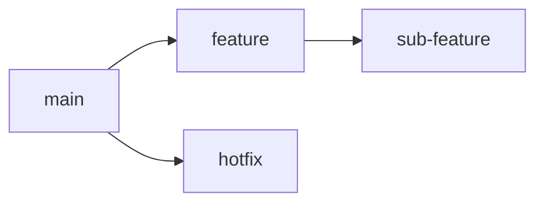

# 🚀 GitとGitHubチートシート

## 📊 基本コマンド

| コマンド | 説明 | 使用例 |
|---------|------|-------|
| `git init` | 新しいリポジトリを初期化 | `git init` |
| `git clone` | リポジトリをクローン | `git clone https://github.com/user/repo.git` |
| `git add` | 変更をステージング | `git add .` または `git add file.txt` |
| `git commit` | 変更をコミット | `git commit -m "コミットメッセージ"` |
| `git push` | リモートにプッシュ | `git push origin main` |
| `git pull` | リモートから取得しマージ | `git pull origin main` |
| `git fetch` | リモートの変更を取得（マージはしない） | `git fetch origin` |
| `git status` | 作業ディレクトリの状態を表示 | `git status` |
| `git log` | コミット履歴を表示 | `git log` |

## 🌿 ブランチ操作

| コマンド | 説明 | 使用例 |
|---------|------|-------|
| `git branch` | ブランチを一覧表示 | `git branch` |
| `git branch <name>` | 新しいブランチを作成 | `git branch feature` |
| `git checkout -b <name>` | ブランチを作成し切り替え | `git checkout -b feature` |
| `git merge <branch>` | 現在のブランチにマージ | `git merge feature` |

## 🔄 変更の取り消し

| コマンド | 説明 |
|---------|------|
| `git reset HEAD <file>` | ステージングを取り消し |
| `git checkout -- <file>` | 作業ディレクトリの変更を破棄 |
| `git revert <commit>` | コミットを打ち消す新しいコミットを作成 |

## 🐙 GitHub操作

1. クローン: `git clone https://github.com/あなたのユーザー名/リポジトリ名.git`
2. ブランチ作成: `git checkout -b 新機能`
3. 変更をプッシュ: `git push origin 新機能`
4. プルリクエスト作成: GitHubウェブサイトで「New pull request」

## 💡 Tips & Tricks

- 📝 良いコミットメッセージを書く: 簡潔で説明的に
- 🔍 `git diff` で変更内容を確認
- 🏷️ タグを使用してリリースをマーク: `git tag -a v1.0 -m "バージョン1.0"`
- 🧹 `git stash` で作業を一時保存

## 🆘 トラブルシューティング

| 問題 | 解決策 |
|-----|-------|
| コンフリクト | ファイルを手動で編集し、`git add` してから `git commit` |
| 間違ったブランチでの作業 | `git stash`, ブランチ切り替え, `git stash pop` |
| 直前のコミットを修正 | `git commit --amend` |

---

🌟 Remember: Practice makes perfect! Happy coding! 🚀

